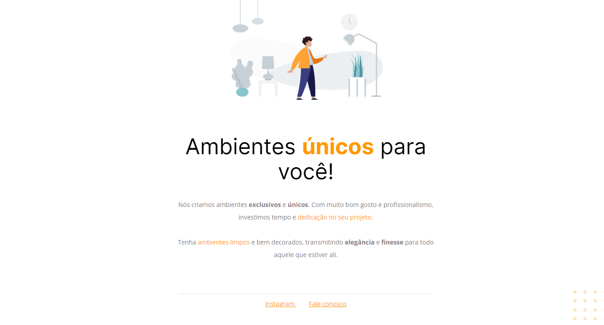

# Projeto 1 Parte 1 Stage 2 🚀

[🔗 Clique aqui para acessar](https://victorm-mp.github.io/Projeto1-Stage2/)

## Tecnologias 🛠
- HTML
- CSS
- Git e Github

## Descrição 📖
Nesse projeto dei meus primeiros passos utilizando HTML e CSS. Resultando nessa landing page, aprendi conceitos básicos de estruturação através do HTML e estilização através do CSS. Depois de ter aprendido um pouco sobre as tags semânticas, decidi implementá-las também. 

## Contato ⭐
victormatheus.mpm@gmail.com

www.linkedin.com/in/victormatheus-mp
